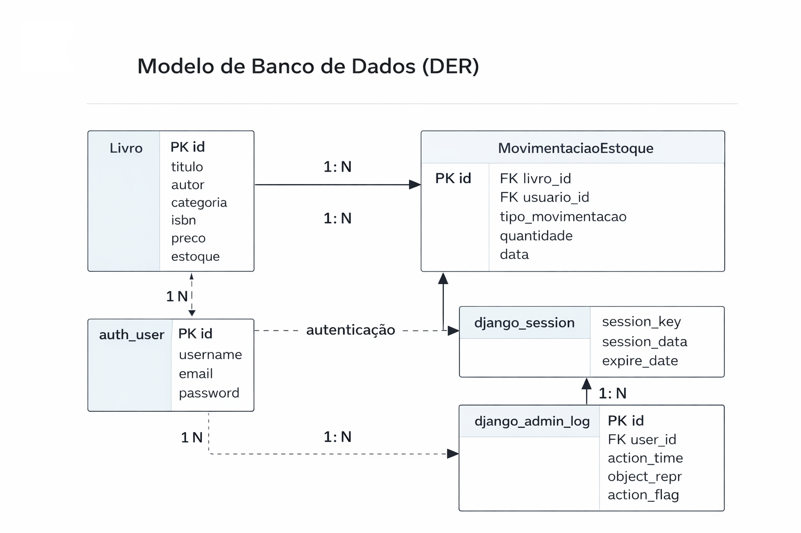

# 📚 Livraria AFI
### Sistema de Gestão de Livros com Django


---

## 📖 Sobre o Projeto

**Livraria AFI** é um sistema web desenvolvido com **Django** para gerenciamento de livros.
O projeto foi criado como parte da disciplina de **Backend com Python**, com foco em boas práticas de CRUD, organização de projeto e utilização do framework Django.

O sistema permite:

- gerenciamento completo de livros
- autenticação de usuários
- busca e paginação
- controle de estoque

---

## 🚀 Funcionalidades

- 🔐 Sistema de login e logout
- 📊 Dashboard inicial
- 📚 CRUD completo de livros
- 🔎 Busca por:
  - título
  - autor
  - ISBN
  - categoria
- 📑 Paginação de resultados
- 🎨 Interface responsiva com Bootstrap
- ⚙️ Painel administrativo Django

---

## 🗄️ Arquitetura do Banco de Dados

O sistema utiliza um **modelo relacional** para organização das informações de livros, usuários e movimentações de estoque.



---

## 🖥️ Fluxo do Sistema

1. Usuário realiza login
2. Acessa o dashboard
3. Gerencia livros através do CRUD
4. Sistema registra movimentações no banco
5. Administrador pode gerenciar dados pelo painel admin

---

## ⚙️ Como Executar o Projeto

### 1️⃣ Clonar o repositório

```bash
git clone https://github.com/limmateech-sketch/livraria-afi.git
cd livraria-afi
```

---

### 2️⃣ Criar ambiente virtual

```bash
python -m venv venv
```

### Ativar ambiente

Windows

```bash
venv\Scripts\activate
```

Linux / Mac

```bash
source venv/bin/activate
```

---

### 3️⃣ Instalar dependências

```bash
pip install -r requirements.txt
```

---

### 4️⃣ Aplicar migrações

```bash
python manage.py migrate
```

---

### 5️⃣ Criar administrador

```bash
python manage.py createsuperuser
```

---

### 6️⃣ Executar servidor

```bash
python manage.py runserver
```

---

## 🌐 Acessos

Login

http://127.0.0.1:8000/login/

Sistema

http://127.0.0.1:8000/livros/

Admin Django

http://127.0.0.1:8000/admin/

---

## 📁 Estrutura do Projeto

```
livraria_afi/
│
├── manage.py
├── requirements.txt
├── README.md
│
├── livraria_afi/
│   └── urls.py
│
├── livros/
│   ├── urls.py
│   ├── views.py
│   ├── forms.py
│   ├── models.py
│   └── templates/
│
└── static/
    └── css/style.css
```

---

## 🛠 Tecnologias Utilizadas

- Python
- Django
- SQLite
- Bootstrap
- HTML
- CSS

---

## 🎓 Contexto Acadêmico

Projeto desenvolvido para a disciplina de **Backend com Python**, com objetivo de praticar:

- desenvolvimento web com Django
- modelagem de banco de dados
- criação de CRUD
- autenticação de usuários

---

## 👨‍💻 Autor

Desenvolvido por **Ailton_Lima_Junior**, 

**Fábio_Silva_Junior** 

e **Isis_Ribeiro**
